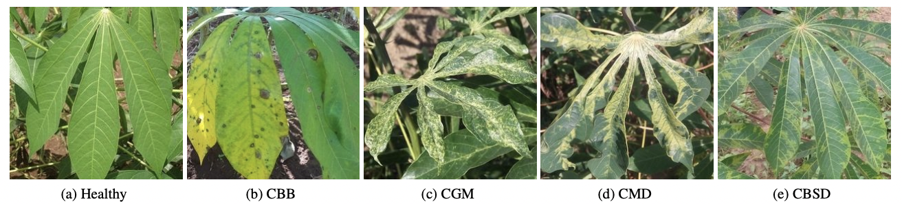

# Cassava Disease Classification
The project is a kaggle competition on cassava disease classification. The project’s objective was to create a model that classifies the data into five different classes of leaf diseases. The dataset used consists of leaf images of the cassava plant, with 9,436 annotated images and 12,595 unlabeled images of cassava leaves. The dataset is divide into 9436 training and 3774 test images. It has also 12595 unlabled extra images. 

We employed various data transformations which includes rotation, flipping, increase of contrast, resizing, and erasing, among others, to learn the invariances efficiently in the image classification. In addition, we used an inbuilt module called ttach(Test Time Augmentation), which helps to perform random modifications to the test images. 

First, we tried convolutional neural network with a structure of Conv → ReLU → MaxPool→ Conv → ReLU → MaxPool → Conv → ReLU → Conv→ ReLU → MaxPool → Linear. The accuracy we recorded was poor, so we opted for pre-trained models. We used different derivatives of resnet pre-trained models. The motivation to use the resnet models was inspired by several works of literature we read about image classification, which showed it worked better in previous studies. We tried resnet50, resnet152 and resnext101. Finally we settled on resnext101 which had best results compared to the other models.We tried to improve on it with pseudo labeling. In pseudo labeling, we used the extra images in the dataset where, we first labeled the extra images with the already trained model, and we took k top-scored images with their labels and trained our model again with these data and the initial training data. However, the pseudo labeling did not help improve our score further, but it recorded the highest test accuracy in the validation data.

To improve the accuracy of our models, we tuned various parameters, including the learning rate, batch size, and the optimizer. In the convolution neural network, we used a stochastic gradient which performed better than the Adam optimizer with an accuracy of 0.35 for 10 epochs. Due to the low accuracy in the convolution model, we settled on the pre-trained models where the Adams optimizer had better results. From the motivation of several works of literature, we settled on Adam’s optimizer version, AdamHD, which performed better and had inbuilt automatic tuning of the parameters such as learning rate. In all cases, we maintained the CrossentropyLoss criterion. After several experiments, we had a batch size=8, input dimension = 550, and 10 epochs worked based on our models. In general, we employed early stopping method to obtain our optimal results in the case of resnext101 model where we stopped training at the 8th epoch which gave the best results.

## Requirements

* pytorch 1.12
* python 3.9

## Results

Model | No. of Epochs | Train loss | Test accuracy(%) | Public scores
------|---------------|------------|------------------|-------------
Convolution | 	10 | 1.131644 | 35.00 | 0.33112
Resnet50 | 10| 0.849484 | 46.00 | 0.35827
Resnext101 | 10 | 0.140204 | 92.02 | 0.91589
Resnet152 | 10 | 0.214874 | 90.01 | 0.88013
Resnext101 with Pseudo labeling(k=500) | 10 | 0.090906 | 94.40 | 0.89867
Resnext101 with Pseudo labeling(k=1000) | 10 | 0.050906 | 93.70 | 0.88013

*k is the size of highly scored extra images to be added in the training data.

## References

[1] [Mwebaze & et al, iCassava 2019 Fine-Grained Visual Categorization Challenge, 2019](https://arxiv.org/abs/1908.02900)

